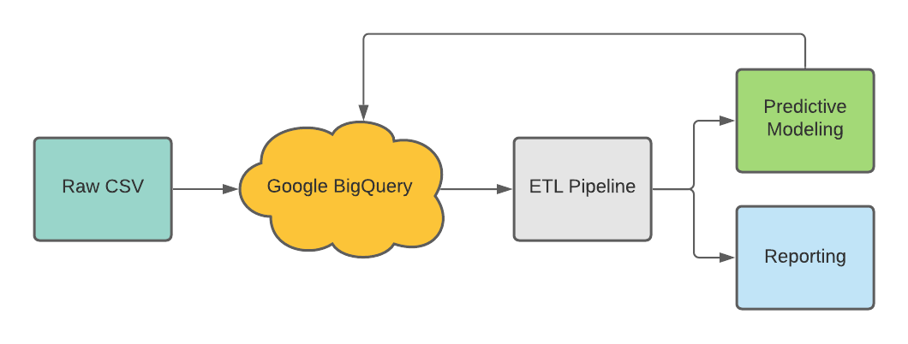

# Cloud Based Warehousing and Reporting Solution that Leverages Predictive Modeling to Target Employees Who are Likley to Leave the Firm
This repository provides a simple tutorial on building a cloud warehousing, interactive reporting, and a predictive modeling solution for businesses concerned with managing employee attrition. 

# Problem
Attrition costs U.S. businesses an estimated 1 trillion dollars every year (Gallup, 2019). Items associated with the total cost of attrition include:
* The total cost of hiring which includes activities such as advertising, interviewing, screening, etc.
* The total cost associated with onboarding, HR administration for related activities, and new-employee training
* The total cost of productivity loss; tenured employees are proven to be more productive in both on-premis and remote work settings (Becker Friedman Institute, 2021)
* The total cost of lower engagement; firms with high attrition have less engaged employees

There is a large economic incentive for firms to manage their voluntary attrition, as well as business and cultural incentives. Because attrition affects firms horizontally and vertically, there could potentially be dozens of bespoke initiatives that address attrition by department, rank, culture, and so on.  

# Objective
In order to facilitate that type of innovation, the firm needs to have:
1. A flexible, repeatable, and intelligent data architecture that will support agility, employee engagement customization, and innovation
2. Robust reporting where access is integrated across the entire firm
3. Supervised learning capabilities to augment business intelligence and accurately predict which employees will leave the firm

# Solution Architecture

* Data warehousing via Google BigQuery
* ETL using SQL, Python (Pandas)
* Interactive reporting and analytics via Python (Plotly, Matplotlib)
* Classification algorithm via Python (Scikit-learn)
* Deploy Model using Google Cloud Platform

## Dataset Acquisition
This dataset is fictional, and was created been created by IBM data scientists. It was last updated in 2017.

## Data Dictionary
|Column Name	|Data Type	|Description |
|-----------| ----------|--------------|
|Age|Int|The age of the employee at a given point in time|
|Attrition|	Boolean|Indicate if the employee left the company or not|
|Business Travel|	Varchar	|Indicates to what level the employee had to travel for business|
|Daily Rate|	Int	|The monetary rate an employee is billed at per day|
|Department	|Varchar	|Indicates which unit of the firm the employee belongs to at a specific point in time|
|Distance From Home|	Int	|Indicates the distance in miles an employee travels to their office|
|Education	|Int	|LOOK UP|
|Education Field	|Varchar	|Indicates the field employees studied during their education
|Employee Count	|Int	|LOOK UP|
|Employee Number|	Int	|Unique identifier for each employee|
|Environment Satisfaction|Int|Indicates the satisfaction the employee has with the company (scale: Likert) at a specific point in time|
|Gender|Varchar	|Indicates which gender an employee identifies as at a specific point in time|
|Hourly Rate|Int|The monetary rate an employee is billed at per hour|
|Job Involvement|Int|Indicates the involvement the employee has with their job (scale: Likert) at a specific point in time|
|Job Level|Int|LOOK UP|
|Job Role|Varchar|Indicates what level of seniority an employee has within their respective departments at the company, during a specific point in time|
|Job Satisfaction|Int|Indicates the satisfaction the employee has within their role at the company (scale: Likert) at a specific point in time|
|Marital Status|Varchar|Indicates if an employee is married, single, divorces, etc. at a specific point in time| 
|Monthly Income|Int|The monetary value of an employee's monthly income (i.e. their monthly salary)|
|Monthly Rate|Int|The monetary value of an employee that is billed to the client|
|Number of Companies Worked|Int|Depicts the number of firms an employee has been employed at over a period of time|
|Over 18|Boolean|Indicates if an employee is over 18|
|Over Time|Boolean|Indicates if an employee has worked over time|
|Percent Salary Hike|	Int	|Indicates the percentage increase in an employee's salary over a period|
|Performance Rating	|Int	|Details the rating an employee received by management for a specific period (scale: Likert)|
|Relationship Satisfaction|	Int|	Depicts the level of satisfaction an employee has in their domestic partnerships|
|Standard Hours |Int	|Details the number of hours an employee is accountable for working over a period of two weeks|
|Stock Option Level|Int|Indicates an employee's stock option benefits (scale: Likert)|
|Total Working Years|Int|Details the number of years an employee has worked over a period of time|
|Training Times Last Year|	Int	|Indicated the number of hours an employee spent training (time - 1 year)|
|Work Life Balance|Int|Details the level of satisfaction an employee has with their obligations in respect to their department, role, etc.| 
|Years at the Company|	Int|	Depicts the number of years an employee has been employed with the firm|
|Years in Current Role|Int|Depicts the number of years an employee has spent in their most current role with the firm|
|Years Since Last Promotion|Int|Depicts the number of years that have passed since an employee received a promotion|
|Years with Current Manager|Int|Depicts the number of years that an employee has reported to the same manager|
